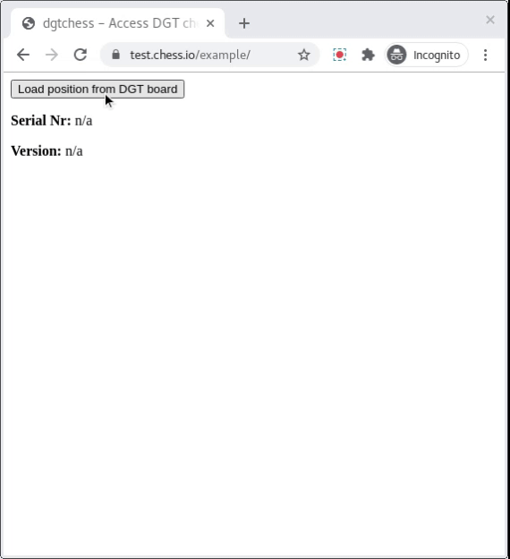

# dgtchess

A JavaScript connector for the electronic [DGT](http://dgtprojects.com) chess board, working both in the browser and node.js.

## Browser Usage

The client version relies on the browser's [Web Serial API](https://wicg.github.io/serial/), which is currently supported only by Google Chrome 80 and later and needs to be enabled via the `#enable-experimental-web-platform-features` flag in `chrome://flags`.

Because the Web Serial API is available only on modern browsers, it is very likely that you can simply import the provided `Board.js` as a JavaScript module. The `Board` constructor expects an open port as returned by the Web Serial API as its first argument.

```
<button onclick="loadBoard()">Load position from DGT board</button>
<script type="module" src="main.js">
  import Board from 'chessground/Board.js'
  async function loadBoard () {
    const port = await navigator.serial.requestPort({})
    const board = new Board(port)
    const { serialNr, version, position } = await board.reset()
    console.log(serialNr, version)
    console.log(position.ascii)
  }
</script>
```

In `example/index.html`, we provide a standalone example web page that loads the DGT chess board's information and dynamically displays the current position:



## Usage with node.js

Using npm, you can install dgtchess by calling this:

```sh
npm install dgtchess
```

The node.js version relies on [Node Serialport](https://serialport.io/) to connect to the DGT chess board. Its path is expected as the first argument of the `Board` constructor, e.g. `/dev/ttyUSB0` on Linux machines. For the node.js version, dgtchess internally maps to `Board.node.js` which replaces some of the Web Serial APIs by the ones provided by Node Serialport.

```js
import Board from 'dgtchess'
const board = new Board('/dev/ttyUSB0')
const { serialNr, version, position } = await board.reset()
console.log(serialNr, version)
console.log(position.ascii)
```

This might result in the following output:

```
13116 1.8
  +------------------------+
8 | .  .  .  .  .  .  .  . |
7 | .  .  Q  .  .  .  .  . |
6 | .  .  .  .  .  .  .  . |
5 | .  .  .  .  .  .  k  . |
4 | .  .  R  .  .  .  .  . |
3 | .  .  .  .  .  .  .  . |
2 | .  .  .  K  .  .  .  . |
1 | .  .  .  .  .  .  .  . |
  +------------------------+
    a  b  c  d  e  f  g  h
```

## Status

This project is still in alpha-status. Unfortunately I don't have access to a DGT chess board, so I can't continue development. Please contact me if you want to continue the development of this module or have a DGT board to lend for some weeks.

The current version of this module uses only the `UPDATE BOARD` modus and instead of moves, only changes are triggered through the 'data' event.

## Background

The protocol for communicating with the electronic chess boards is well documented by DGT in [their developer section](http://www.dgtprojects.com/site/index.php/dgtsupport/developer-info). There you can find the [DGT Electronic Board Protocol Description (version 20120309)](http://www.dgtprojects.com/site/index.php/dgtsupport/developer-info/downloads/doc_download/85-dgt-electronic-board-protocol-description-version-20120309) which is the base for this JavaScript implementation.
